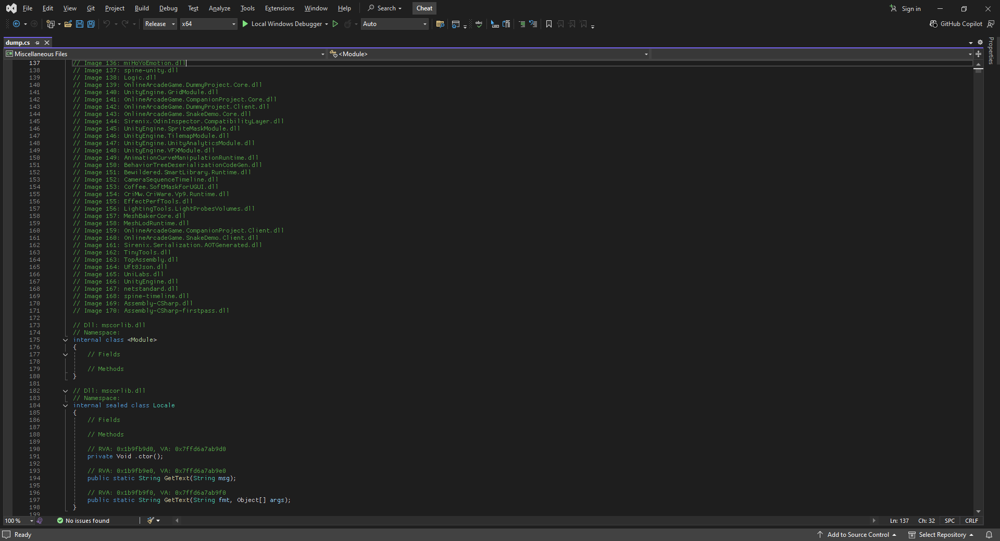
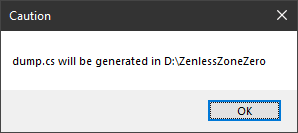
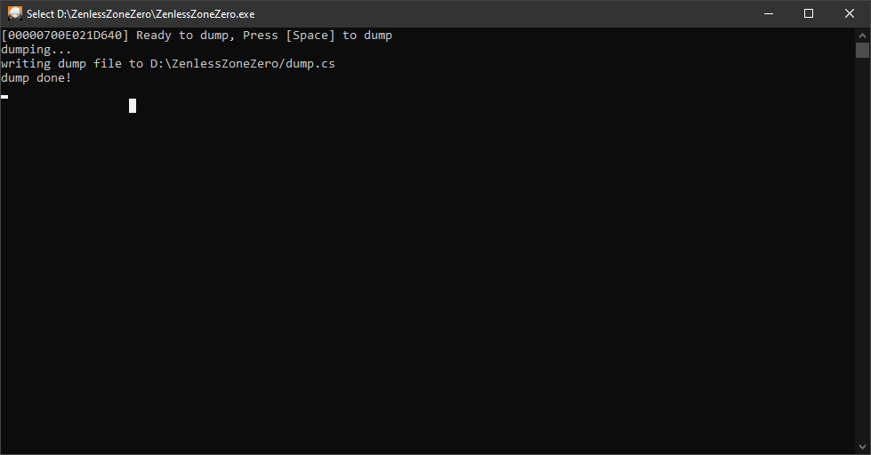

# Zenless-Zone-Zero-Dumper
An Il2Cpp Dumper, SDK generator for Zenless Zone Zero game.
> Only work for ZZZ so ***don't*** use it for other games
---

---
## Usage
1. Download latest **Dumper.dll** release from [here](https://github.com/fakekey/Zenless-Zone-Zero-Dumper/releases/latest/download/Dumper.dll)
2. Use an injector to inject `dumper.dll` into the game as fast as possible upon startup.
3. If successful, you should see a dialog like this:

4. Press `OK` then **Wait** a few seconds for the game to load. Once the dumper is ready, this line of text will appear:

5. Press `Space` to dump and wait a moment.
> **Troubleshooting:** If the dialog fails to appear or the game crashes, just exit the game and try again from **STEP 2**.
